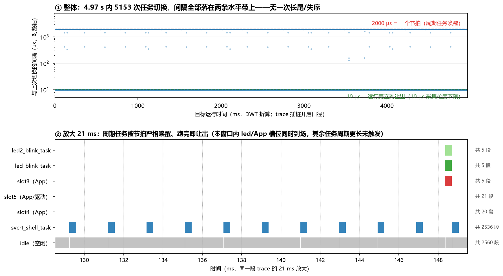
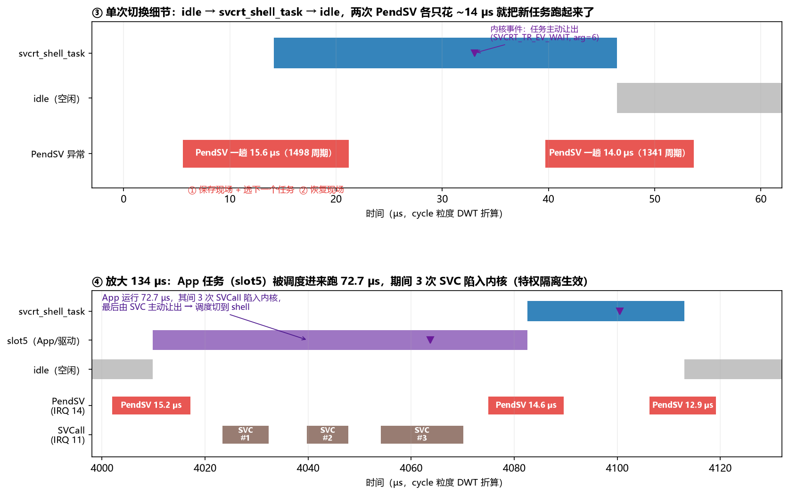
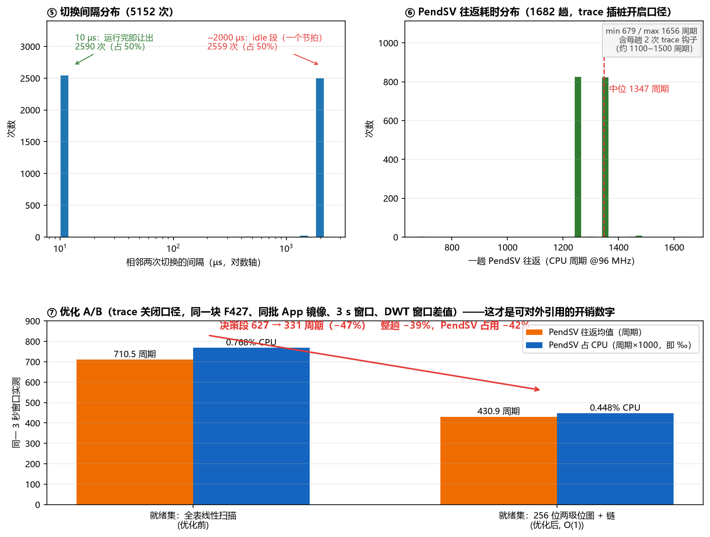

# SVCrtOS

SVCrtOS 是一个面向 ARM Cortex-M 系列微控制器的安全实时操作系统（RTOS），采用 SVC（Supervisor Call）实现特权级隔离，利用 MPU 进行内存保护，支持多任务分区调度和统一设备驱动框架。

## 核心特性

- **SVC 特权隔离**：用户任务通过 SVC 系统调用进入内核态，内核态代码受硬件保护，用户任务无法直接访问
- **MPU 内存保护**：利用 Cortex-M MPU 实现任务间 ROM/RAM 空间隔离，防止越界访问
- **优先级 + 时间片调度**：支持多优先级抢占和同优先级时间片轮转
- **事件驱动机制**：轻量级事件同步原语，支持超时等待
- **信号量与互斥锁**：计数信号量 + 带优先级继承的互斥锁，防止优先级反转
- **设备驱动框架**：统一设备 I/O 接口（open/close/read/write/ctrl），支持内置驱动
- **独立驱动固件**：驱动可编译为完全独立的固件烧录到专属 ROM 分区，与内核解耦，支持独立升级；App 仅凭设备名即可访问，无需知道驱动实现或地址
- **FIFO 缓冲区**：环形缓冲区，用于内核和驱动间的数据传输
- **栈溢出检测**：通过 PSP 越界检测任务栈溢出
- **任务栈用量分析**：栈填充 + 最低栈指针双手段统计每任务峰值用量，为裁剪栈空间提供依据
- **自旋锁与调度器锁**：内核/驱动侧自旋锁（原子 CAS + 关中断变体，面向 SMP 扩展），用户态调度器锁（禁止任务切换的轻量临界区）
- **CPU 负载统计**：实时统计 CPU 空闲率
- **FPU 支持**：Cortex-M4F/M7 浮点寄存器（S16-S31）按需自动保存/恢复
- **统一镜像池 + 两种安装策略**：App 与驱动共用一个池，安装时按 1 KB 粒度贴合放置；整机可选「固定槽位」（落点与 RAM 窗口按配置走，适合交付客户二次开发）或「自动选址」（在池内找最大连续空位，卸载按力度回收）
- **设备端持久配置区**：安装策略、槽位表与运行期参数写在独立的配置扇区，由上位机在线写入（`tools/svcrt_cfg.py` 或图形界面），不必重新编译；策略类字段重启后生效——写入的命令是 `cfg load`，它负责**接收**记录，不是「重新读一遍」
- **线程服务**：App / 驱动可以在自己的固件与 RAM 窗口内创建线程（SVC 0x1B），入口与栈都要落在调用者自己的窗口内，否则拒绝
- **POSIX / Windows 兼容层**：`pthread` / `semaphore` / `mqueue` / `unistd` 与 `CreateThread` / `Sleep` / `strcpy_s` 等常用名直接可用，移植既有 C 程序改 include 列表即可
- **双 SDK 架构**：独立的应用 SDK 和驱动 SDK，支持编译为独立分区固件
- **内核与芯片解耦**：采用 RT-Thread 类似的分层架构，内核零芯片依赖，移植只需修改 board/ 目录

## 支持 CPU 架构

| 架构 | FPU | MPU | 移植层状态 |
|------|-----|-----|------|
| Cortex-M3 | - | 有 | 已实现 |
| Cortex-M4 | 有 | 有 | 已实现（推荐） |
| Cortex-M7 | 有 | 有 | 已实现（复用 M4 移植层约定） |
| RISC-V（RV32/RV64） | 按核心 | PMP | 抽象层已就绪，移植实现待补 |
| LoongArch（LA32/LA64） | 按核心 | TLB/地址窗口 | 抽象层已就绪，移植实现待补 |

### 架构抽象层

内核与指令集之间只有一层契约，全部收敛在 `kernelsrc/include/svcrt_arch.h`（架构描述与派生能力）
与 `svcrt_hal.h`（端口接口声明）两个头文件中：

1. **两级架构描述**：`SVCRT_ARCH_FAMILY_xxx`（架构族）+ `SVCRT_CPU_CORE_xxx`（具体核心），
   由 `SVCRT_ARCH_CORE` 或兼容旧工程的 `SVCRT_CPU_ARCH` 选择；FPU / MPU / 特权级 / SVC 号位宽
   等能力默认值由核心自动派生
2. **系统调用上下文不透明**：内核 `SVC_Server(void *)` 只通过
   `SVCRT_SVC_NUM / SVCRT_SVC_ARG / SVCRT_SVC_RET` 三个宏访问调用号、参数与返回值，
   栈帧布局完全由 port 层解析（Cortex-M 用硬件压栈帧，RISC-V / LoongArch 用各自 trap 帧）
3. **上下文切换三接口**：`svcrt_port_stack_init()`（栈帧初始化）、
   `svcrt_port_switch_task()`（触发切换）、`svcrt_port_enter_idle()`（启动首个上下文）
4. **内存保护统一描述**：`svcrt_arch_mpu_t`（`region_base` / `region_attr` 两组寄存器）
   承载每任务的隔离上下文，Cortex-M 映射到 `RBAR/RASR`，RISC-V 映射到 `pmpaddr/pmpcfg`，
   LoongArch 映射到 TLB / 地址窗口，内核不感知具体机制
5. **临界区状态化**：`svcrt_port_enter_critical()/exit_critical()` 保存并恢复中断状态、支持嵌套，
   适配需要保存 `mstatus.MIE`（RISC-V）、`CRMD.IE`（LoongArch）的架构
6. **时钟统一命名**：`svcrt_port_get_timer_counter()/get_timer_reload()` 屏蔽
   SysTick / mtime / 恒定频率定时器差异

新增架构只需在 `kernelsrc/port/<族>/<核心>/` 下实现上述接口，**内核源码零改动**；
完整步骤与验收清单见 [移植层说明](kernelsrc/port/README.md)。

## 目录结构

```
SVCRTOS/
├── kernelsrc/                      # ★ 内核源码（零芯片依赖）
│   ├── include/                    # 内核头文件
│   │   ├── svcrt.h                 # 应用 API
│   │   ├── svcrt_arch.h            # ★ 架构抽象层（架构族/核心/能力派生/MPU 上下文）
│   │   ├── svcrt_config.h          # 集中配置（可被板级配置覆盖）
│   │   ├── svcrt_port.h            # 硬件抽象接口（纯声明，无芯片依赖）
│   │   ├── svcrt_types.h           # 基础类型定义
│   │   └── ...                     # 其他内核内部头文件
│   ├── src/                        # 内核源文件（纯C，无硬件操作）
│   │   ├── svcrt_init.c            # 内核启动与初始化
│   │   ├── svcrt_task.c            # 任务调度 + SVC 分发
│   │   ├── svcrt_event.c           # 事件管理
│   │   ├── svcrt_fifo.c            # FIFO 环形缓冲区
│   │   ├── svcrt_dev.c             # 设备驱动框架
│   │   └── svcrt_cfg.c             # 任务配置加载
│   ├── app/                        # 应用模板
│   ├── sdk/                        # SDK 开发包
│   │   ├── app_sdk/                # App SDK
│   │   ├── driver_sdk/             # Driver SDK
│   │   └── posix/                  # POSIX / Windows 兼容层（App 侧，见其 README）
│   ├── shell/                      # 内核控制台（ark-shell + SVCrtOS 平台适配层）
│   └── components/                 # 可选组件
│
├── board/                          # ★ 板级移植层（芯片相关）
│   └── stm32f427/                  # STM32F427 移植示例
│       ├── svcrt_board.c           # 移植接口 + 中断入口 + 板载设备注册
│       ├── svcrt_board_config.h    # 板级配置覆盖（主频、内存地址等）
│       ├── drvuart.c/h             # UART 驱动（HAL库）
│       └── drvled.c/h              # LED 驱动（HAL库）
│
├── kernelsrc/port/                 # ★ CPU 架构移植层：port/<架构族>/<核心>/
│   ├── README.md                   # 移植层说明与新架构移植指南
│   ├── arm/cortex-m3/              # Cortex-M3（无 FPU）
│   └── arm/cortex-m4/              # Cortex-M4
│       ├── svcrt_context.S         # PendSV 上下文切换汇编（含 FPU 寄存器）
│       └── svcrt_port.c            # 系统调用上下文/栈帧/临界区/定时器/MPU 实现
│
├── tools/                          # 上位机工具（gen_scatter / pack_app / svcrt_layout / gen_api_doc）
├── docs/                           # 文档，索引见 docs/README.md
└── example/                        # 工程示例
    └── stm32f427/                  # MDK 工程
```

**架构解耦原则：**
- `kernelsrc/` = 纯内核，不包含任何芯片头文件，不直接操作任何硬件寄存器
- `board/` = 芯片相关，移植到新芯片只需创建新的 `board/<芯片>/` 目录
- `svcrt_port.h` / `svcrt_hal.h` = 内核与硬件的唯一耦合点，纯函数声明
- `svcrt_arch.h` = 架构描述与能力派生；新增架构只需在 `port/<架构族>/<核心>/` 下实现接口，内核零改动

## 系统架构

```
┌──────────────────────────────────────────────────────────────────────┐
│                  用户层 (Unprivileged)                                │
│  ┌──────────────┐  ┌──────────────┐  ┌──────────────┐               │
│  │  App Task1   │  │  App Task2   │  │  App TaskN   │               │
│  │  (svcrt.h)   │  │  (svcrt.h)   │  │  (svcrt.h)   │               │
│  └──────┬───────┘  └──────┬───────┘  └──────┬───────┘               │
│         │  SVC 0x10~0x13  │                 │                        │
├─────────┼─────────────────┼─────────────────┼────────────────────────┤
│         └─────────────────┼─────────────────┘                        │
│           内核 kernelsrc/ (零芯片依赖)                                 │
│  ┌──────────────┐  ┌──────────────┐  ┌──────────────┐               │
│  │  任务调度    │  │  事件管理    │  │  设备框架    │               │
│  └──────────────┘  └──────────────┘  └──────────────┘               │
│  ┌──────────────┐  ┌──────────────┘                                  │
│  │  FIFO 缓冲   │  │  配置加载   │                                   │
│  └──────────────┘  └──────────────┘                                  │
├──────────────────────────────────────────────────────────────────────┤
│        svcrt_port.h (硬件抽象接口，纯声明)                             │
├──────────────────────────────────────────────────────────────────────┤
│        board/<芯片>/ (板级移植层)                                      │
│   svcrt_board.c / svcrt_mpu.c / 驱动 / 中断入口                      │
└──────────────────────────────────────────────────────────────────────┘
```

## 应用 API

用户程序包含 `svcrt.h` 即可使用所有操作系统接口，所有调用通过 SVC 指令陷入内核态执行。

### 阻塞接口的超时语义（统一约定）

event / sem / mutex / mq 的等待接口共用同一套 `timeout_ms` 约定，与 FreeRTOS、
RT-Thread、Zephyr 一致：

| 取值 | 语义 |
|------|------|
| `timeout_ms == 0` | **不等待**：只试一次，条件不满足立即返回超时 |
| `timeout_ms > 0` | 最多等待 `timeout_ms` 毫秒，超时返回 |
| `timeout_ms < 0` | **永久等待**，直到条件满足 |

```c
svcrt_mutex_lock(mtx, -1);   /* 永久等待（推荐写法，语义一眼可见） */
svcrt_mutex_lock(mtx, 0);    /* 只试一次，拿不到就返回超时 */
```

> 早期版本把 0 当作"永久等待"，与主流 RTOS 相反，且同一头文件里三类接口写法不一致。
> 现已统一为上面的约定，仓库内的调用点也全部改成显式 `-1`。

### 任务管理

| API | 说明 |
|-----|------|
| `svcrt_task_wait(ms)` | 等待指定毫秒（阻塞调度） |
| `svcrt_task_wait_period()` | 等待当前周期结束 |
| `svcrt_task_delay(us)` | 微秒级忙等延时 |
| `svcrt_task_kill()` | 终止当前任务 |

### 设备操作

| API | 说明 |
|-----|------|
| `svcrt_dev_open(name, param)` | 打开设备，返回句柄 |
| `svcrt_dev_close(handle)` | 关闭设备，释放句柄 |
| `svcrt_dev_read(handle, buf, len)` | 从设备读取数据 |
| `svcrt_dev_write(handle, buf, len)` | 向设备写入数据 |
| `svcrt_dev_ctrl(handle, code, value)` | 设备控制命令 |

### 事件与系统信息

| API | 说明 |
|-----|------|
| `svcrt_event_create(name)` | 创建命名事件 |
| `svcrt_event_wait(handle, timeout)` | 等待事件（可超时） |
| `svcrt_event_set(handle)` | 触发事件 |
| `svcrt_get_time_ms()` | 获取系统运行时间（ms） |
| `svcrt_get_cpu_usage()` | 获取 CPU 空闲率 |

### 信号量与互斥锁

| API | 说明 |
|-----|------|
| `svcrt_sem_create(name, init)` | 创建计数信号量 |
| `svcrt_sem_wait(handle, timeout)` | 等待信号量（计数减一/挂起） |
| `svcrt_sem_post(handle)` | 释放信号量（唤醒等待者/计数加一） |
| `svcrt_sem_delete(handle)` | 删除信号量 |
| `svcrt_mutex_create(name)` | 创建互斥锁 |
| `svcrt_mutex_lock(handle, timeout)` | 加锁（支持优先级继承） |
| `svcrt_mutex_unlock(handle)` | 解锁（仅持有者可解锁） |
| `svcrt_mutex_delete(handle)` | 删除互斥锁 |

### 消息队列（SVC 0x16）

| API | 说明 |
|-----|------|
| `svcrt_mq_create(name)` | 创建消息队列（深度 `SVCRT_MQ_DEPTH`，单条最长 `SVCRT_MQ_MSG_WORDS` 字） |
| `svcrt_mq_send(h, buf, len_words, timeout)` | 发送一条 `len_words` 字的消息（1..`SVCRT_MQ_MSG_WORDS`；拷贝语义，满时阻塞可超时） |
| `svcrt_mq_recv(h, buf, len_words, timeout)` | 接收一条消息，拷入 `len_words` 字的调用者缓冲（空时阻塞可超时） |
| `svcrt_mq_delete(h)` | 删除消息队列 |

**消息是变长的**：`len_words` 由调用者给出，内核只拷这么多字、槽内其余字节补 0，并在槽内记下实际长度。
`len_words` 必须 ≤ 接收缓冲的容量——**调用者缓冲是硬边界**。

返回值约定：`svcrt_mq_send` 返回 0=成功、负值=超时或错误；`svcrt_mq_recv` 返回**实际收到的字数**（>0），负值=超时或错误。

### 软定时器（SVC 0x17）

| API | 说明 |
|-----|------|
| `svcrt_timer_create(name)` | 创建定时器 |
| `svcrt_timer_start(h, period_ms, mode, cb, arg)` | 启动；mode 为单次/周期 |
| `svcrt_timer_stop(h)` | 停止 |
| `svcrt_timer_delete(h)` | 删除 |

到期回调统一在内核自动注册的定时器服务任务上下文中执行（优先级 `SVCRT_TIMER_TASK_PRI`），tick 中断只做倒计时与唤醒，不执行用户回调，保证 SVC 特权隔离不被破坏。

### 任务诊断与故障恢复（SVC 0x11 扩展 + 0x12 扩展）

| API | 说明 |
|-----|------|
| `svcrt_task_status_get(task_id)` | 查询任务状态（READY/WAIT/RUNNING/INVALID） |
| `svcrt_task_recover_req(task_id)` | 请求任务故障恢复（两阶段：重建栈帧后重新调度） |
| `svcrt_fault_record_count()` | 查询故障记录条数 |
| `svcrt_fault_record_read(index, out3)` | 读取第 index 条记录（类型/任务号/tick） |

HardFault/栈溢出自动写入故障环形记录（容量 `SVCRT_FAULT_RECORD_NUM`，记满覆盖最旧）；使能 `SVCRT_USE_FAULT_RECOVER` 后故障任务自动重建恢复，不再永久丢失任务槽位。

### 线程服务（SVC 0x1B）

App / 驱动在**自己的 RAM 窗口内**创建线程。线程需要 TCB 与调度器槽位，只有内核有，
所以必须走这一组调用：

| API | 说明 |
|-----|------|
| `svcrt_thread_create(entry, stack, stack_size, priority, period_ms)` | 创建线程，返回任务号（>0）；`period_ms=0` 为事件驱动，>0 为周期线程 |
| `svcrt_thread_self()` | 当前任务号（>0） |
| `svcrt_thread_exit()` | 结束当前线程，不再返回 |

内核在创建时做两道边界校验，不通过就拒绝而不是静默接受：

1. **入口必须落在调用者自己的固件窗口内**；
2. **整段栈必须落在调用者自己的 RAM 窗口内**（内核不会给别人分配或跨窗口使用栈）。

`priority` 取 1..254，`255` 是调度器「无候选」哨兵，会被显式拒绝。

不想直接用它的话，`kernelsrc/sdk/posix/` 提供了一层 POSIX / Windows 兼容层，
用 `pthread_create` / `CreateThread` 的写法即可，见 [POSIX与Windows兼容层说明.md](docs/POSIX与Windows兼容层说明.md)。

### 中断上下文安全 API（特权态直调，不经 SVC）

| API | 说明 |
|-----|------|
| `svcrt_sem_post_from_isr(h)` | 在 ISR 中释放信号量（唤醒任务，不切换） |
| `svcrt_event_set_from_isr(h)` | 在 ISR 中触发事件 |
| `svcrt_mq_send_from_isr(h, buf, len)` | 在 ISR 中发送消息（满则丢弃返回 -1） |

## 驱动开发接口

SVCrtOS 的驱动有两种部署形态，**核心亮点是「独立驱动」——驱动可以编译为完全独立的固件，与内核解耦、独立烧录、独立升级**：

| 形态 | 编译方式 | 部署 | 适用场景 |
|------|---------|------|---------|
| 内置驱动 | 随内核一起编译 | 与内核同一固件 | 板载固定外设 |
| **独立驱动** | **单独编译为 .bin/.hex** | **烧录到专属 ROM 分区** | **可热插拔/独立升级的驱动** |

### 独立驱动（External Driver）

独立驱动是一个**自带启动代码、自带分散加载脚本、独立编译链接**的固件，烧录到内核之外的专属 ROM/RAM 分区。内核把该分区入口注册为任务后调度运行，驱动在用户态执行，通过 SVC `0x14` 向内核注册设备。注册后，**任何 App（无论内置还是独立固件）都可以用设备名打开它**，完全不需要知道驱动的实现或地址。

```
┌─────────────────────┐   ┌─────────────────────┐   ┌─────────────────────┐
│   内核固件           │   │  独立驱动固件 BLED   │   │  独立应用固件 BLED   │
│   (ROM 分区 0)       │   │  (ROM 分区 1)        │   │  (ROM 分区 2)        │
│                     │   │                     │   │                     │
│  任务调度/设备框架   │   │  DrvMain()          │   │  AppMain()          │
│         ▲           │   │   ├ 注册 "BLED"     │   │   ├ open("BLED")    │
│         │ SVC 0x14  │?──┼───┘ (svcrt_drv_     │   │   └ write(...)      │
│         │ 注册设备   │   │      register)      │   │         │           │
│         │           │   │                     │   │         │ SVC 0x10  │
│         └───────────┼───┼─────────────────────┼───┼─────────┘ 设备 IO   │
│      内核查表分发到驱动函数指针，三个固件互不依赖地址                      │
└─────────────────────┘   └─────────────────────┘   └─────────────────────┘
```

驱动开发者只需包含 `svcrt_driver_sdk.h`，实现 `svcrt_dev_drv_t` 接口，并在 `DrvMain()` 中注册：

```c
#include "svcrt_driver_sdk.h"

/* 1. 实现 5 个标准设备接口 */
static svcrt_dev_drv_t bled_drv = {
    bled_drv_open,
    bled_drv_close,
    bled_drv_read,
    bled_drv_write,
    bled_drv_ctrl
};

/* 2. 独立固件入口：注册设备名后即可被任意 App 使用 */
void DrvMain(void)
{
    svcrt_drv_register("BLED", &bled_drv, 0);   /* SVC 0x14 注册到内核 */

    while(1)
    {
        svcrt_task_wait(1000);   /* 驱动可常驻做后台维护，也可注册后退出 */
    }
}
```

应用侧无需关心驱动是内置还是独立固件，统一用设备名访问：

```c
int32 h = svcrt_dev_open("BLED", 0);   /* 内核查表，自动路由到独立驱动 */
int32 on = 1;
svcrt_dev_write(h, &on, 1);            /* 点亮蓝灯 */
```

> **独立驱动注意事项**：
> 1. 启动汇编必须经 C 库入口 `__main` 完成 `.data` 拷贝、`.bss` 清零，否则 `bled_drv` 函数指针表为随机值，注册后调用会 HardFault。
> 2. 驱动固件、应用固件、内核固件的 ROM/RAM 分区地址必须互不重叠（由各自的分散加载脚本 `.sct` 约定）。
> 3. 在 MPU 隔离环境下，独立驱动若需直接访问外设寄存器，需由内核授予对应外设区域权限。
>
> 完整可运行示例见 `example/stm32f427/driver_sdk/BLED_DRV/`（独立驱动）与 `example/stm32f427/app_sdk/BLED_APP/`（独立应用），端到端说明见 `example/stm32f427/BLUE_LED_E2E_README.md`。

## 内核配置参数

所有配置参数集中在 `svcrt_config.h` 中管理，芯片相关参数可通过板级配置文件覆盖。

| 参数名 | 默认值 | 说明 |
|--------|--------|------|
| `SVCRT_CPU_ARCH` | 由架构头派生（本板 `SVCRT_ARCH_CORTEX_M4`） | CPU 架构选择 |
| `SVCRT_USE_FPU` | 由架构派生，本板 1 | 浮点单元使能 |
| `SVCRT_USE_MPU` | 由架构派生，本板 0 | MPU 内存保护使能（**未接线**，见 `kernelsrc/src/svcrt_mpu.c` 的 @warning） |
| `SVCRT_USE_PRIV` | 依赖 `SVCRT_USE_MPU`，本板 0 | 特权级分离使能 |
| `SVCRT_TASK_MAX_NUM` | 48 | 任务表总容量（静态 TCB 数组元素个数）。默认值已**移到 `config/svcrt_partition.h` 第九节**，与分区策略同源，见下文「任务容量分层」 |
| `SVCRT_TASK_TABLE_RAM_MAX` | 8192 | TCB 数组的 RAM 预算上限（字节），**固定 8KB，不随容量派生**；守护断言直接比较 `sizeof(svcrt_task_table)`，超出则编译报错 |
| `SVCRT_TICK_PERIOD_US` | 500 | 滴答周期（微秒） |
| `SVCRT_EVENT_NUM` | 10 | 事件对象数量 |
| `SVCRT_MAX_EVENT_WAITERS` | 4 | 单个事件的等待者上限 |
| `SVCRT_SEM_NUM` / `SVCRT_MTX_NUM` | 8 / 8 | 信号量 / 互斥锁对象数量 |
| `SVCRT_MAX_SYNC_WAITERS` | 4 | 单个信号量/互斥锁的等待者上限 |
| `SVCRT_DEV_MAX_NUM` | 8 | 最大设备数量 |
| `SVCRT_USE_SPINLOCK` | 1 | 自旋锁开关（svcrt_spin.h） |
| `SVCRT_USE_SCHED_LOCK` | 1 | 用户态调度器锁开关（SVC 0x11 子命令 7~9） |
| `SVCRT_USE_STACK_USAGE` | 1 | 任务栈峰值用量统计开关 |
| `SVCRT_STACK_FILL_PATTERN` | 0xcdcdcdcd | 栈填充图案（用于水位统计） |
| `SVCRT_USE_CPU_LOAD` | 1 | CPU 负载统计开关 |
| `SVCRT_USE_STACK_CHECK` | 1 | 栈溢出检测开关 |
| `SVCRT_SHARE_MEM_ADDR` / `SVCRT_SHARE_MEM_SIZE` | — | **已删除**：共享内存位置由 `config/svcrt_partition.h` 的 `SHARE_RAM_BASE` / `SHARE_RAM_SIZE` 决定 |
| `SVCRT_SYSTEM_CLOCK_HZ` | 168000000 | 系统主频（板级配置覆盖） |
| `SVCRT_USE_MQ` / `SVCRT_MQ_NUM` | 1 / 8 | 消息队列开关与数量 |
| `SVCRT_MQ_DEPTH` / `SVCRT_MQ_MSG_WORDS` | 8 / 4 | 队列深度与单条消息长度（字） |
| `SVCRT_USE_TIMER` / `SVCRT_TIMER_NUM` | 1 / 8 | 软定时器开关与数量 |
| `SVCRT_TIMER_TASK_PRI` | 200 | 定时器服务任务优先级 |
| `SVCRT_TIMER_TASK_STACK_WORDS` | 96 | 定时器服务任务栈大小（字） |
| `SVCRT_USE_FAULT_RECOVER` | 1 | 任务故障自动恢复开关 |
| `SVCRT_FAULT_RECORD_NUM` | 8 | 故障记录环形缓冲容量 |
| `SVCRT_USE_STACK_CHECK` / `SVCRT_STACK_END_FLAG` | 1 / 0xed01 | 栈溢出检测开关与栈底保护字 |

所有配置宏都用 `#ifndef` 包裹，板级配置先于 `svcrt_config.h` 加载，因此**覆盖板级配置
是唯一入口**，不需要改 `kernelsrc/`。

### 分区与镜像策略开关（`config/svcrt_partition.h`）

地址与分区布局只在 `config/svcrt_partition.h` 里定义一次，其余地址一律派生；
`.sct` 由 `tools/gen_scatter.py` 生成，属构建产物，**不要手工编辑**。
几个影响运行行为的策略开关：

| 宏 | `config/` 默认 | 说明 |
|----|----|----|
| `APP_AUTO_START` / `DRIVER_AUTO_START` | 1 | **只影响裸镜像路径**（Keil 直接烧录的镜像没有镜像头，无法自带自启标志）。带头的 `.svcapp` 的自启由镜像头 `flags` 决定，并可在设备端配置区里逐槽改写 |
| `APP_ALLOW_RAW_IMAGE` | 0 | 是否认领裸镜像（无镜像头、直接烧进池的固件）。编译期默认 0，F427 板级置 1；**运行期还要设备端配置区 `flags` 的 `RAW_ALLOW` 位一起成立**，两处都开才生效 |
| `APP_CRASH_RESTART_MAX` | 3 | App/驱动连续故障重启上限，达到即禁用；0 = 不限次 |
| `INSTALLER_ENABLE` | 1 | 内核内安装模块（占用 COM1）；不用串口安装时置 0 |
| `SHELL_ENABLE` | 1 | 内核 Shell 控制台（ark-shell，占用 `SHELL_DEV_NAME`）；置 1 时不注册常驻安装任务，安装改由 `install` 命令触发一次性窗口 |
| 镜像头 `flags` | 0x1 | 逐槽开机自启标志，打包时由 `tools/pack_app.py --autostart / --no-autostart` 写入；运行期用 `app list` / `drv list` 的 auto 列查看 |
| `SLOT_MAX` / `SVCRT_CFG_SLOT_MAX` | 16 / 8 | 槽位记录条数上限（共享表数组 / 设备端配置区容量）。两者都必须 ≤ `SVCRT_SLOT_ARRAY_MAX`（16，见 `svcrt_share.h`），越界由编译期断言拦住 |
| `SVCRT_DEV_SLOT_MAX` / `SVCRT_DEV_RAM_WINDOW` | 4 / 16 KB | 开发槽位表条目数与每条的 RAM 窗口。窗口序号 = 起始单元号 % 条目数，公式与 `tools/gen_scatter.py` 的 `dev_ram_base` 同源 |
| `SVCRT_RECLAIM_MODE` | `SVCRT_RECLAIM_GLOBAL` | 自动选址模式下的卸载回收力度：全局压实 / 只处理含失效字节的扇区 |
| `DRIVER_TASK_STACK_SIZE` / `APP_TASK_STACK_SIZE` | 1K / 4K | 驱动 / App 任务栈，从**各自槽位那块 RAM** 的顶部切出 |

> 注意：Loader / App 工程**禁止** `#include "svcrt_partition.h"`，布局在运行期经 SVC 0x18 获取。

### 任务容量分层（扩容入口）

任务表是一块静态 TCB 数组，容量在编译期定死。为了让「很多用户驱动 + 很多用户应用」
的场景可以直接扩到大规模，容量按**内核 / 驱动 / 应用**三类分层，全部集中在
`config/svcrt_partition.h` 第九节（与 Flash/RAM 布局同一个文件，避免改一处忘另一处）：

| 宏 | 默认值 | 说明 |
|----|----|----|
| `SVCRT_TASK_MAX_NUM` | 48 | 任务表总容量，扩规模只改这个数字 |
| `SVCRT_TASK_MAX_KERNEL` | 8 | 内核自带任务 + 示例静态任务的预留 |
| `SVCRT_TASK_PER_DRIVER` | 1 | 每个驱动镜像占用的任务数 |
| `SVCRT_TASK_PER_APP` | 1 | 每个 App 镜像占用的任务数 |
| `SVCRT_TASK_NEED_MIN` | 派生 | `内核 + 槽位数 × 每槽任务数` 之和，即分区策略要求的最小容量 |
| `SVCRT_TASK_TABLE_RAM_MAX` | 8192 | 静态 TCB 数组的 RAM 预算（字节），固定值；实测 `sizeof(svcrt_task_t)` = 76 字节（MPU 关）/ 140 字节（MPU 开） |

编译期断言 `svcrt_task_capacity_check` 会拦住「容量装不下当前槽位策略」的配置；
`svcrt_cfg.c` 的 `svcrt_task_table_ram_check` 再拦一道 RAM 预算。

`svcrt_config.h` 不再自带这两个宏的默认值，而是 `#include "svcrt_partition.h"`；
板级配置仍然优先（分区头里的定义用 `#ifndef` 包裹，且板级配置先于它加载）。

### 分区、槽位与 ABI 版本

Flash 布局（F427，1 MB）：`BOOT(0)` → `KERNEL(128 KB)` → `CONFIG(128 KB，一个物理扇区)` → `IMAGE_POOL(768 KB，6 × 128 KB 单元)`。

| 项 | 值 | 说明 |
|----|----|----|
| 内核区 | `KERNEL_SIZE` = 128 KB @ `0x08000000` | **可按编译结果调整**（内核大了就给它更多）；改动只在这一个宏 |
| 配置区 | `CONFIG_SIZE` = 128 KB @ `0x08020000` | 设备端持久配置：安装策略、槽位表、运行期参数，由上位机在线写入 |
| 镜像池 | `IMAGE_POOL_SIZE` = 768 KB @ `0x08040000`，6 × 128 KB 单元 | App 与驱动**共用统一池**；单元内按 1 KB 粒度分配 |
| 槽位条目 | `SLOT_MAX` = 16（配置区 `SVCRT_CFG_SLOT_MAX` = 8） | 一次能记录的镜像条目数，≤ `SVCRT_SLOT_ARRAY_MAX`(16) |
| 开发槽位 | `SVCRT_DEV_SLOT_MAX` = 4，窗口 `SVCRT_DEV_RAM_WINDOW` = 16 KB | 只服务「Keil 直接烧录 + 下断点」这条旁路；裸镜像不可搬移、不参与回收 |
| RAM 池 | `SLOT_RAM_TOTAL` = 64 KB @ `0x20010000` | 伙伴分配，块大小 1 KB ~ 32 KB |
| 共享内存 ABI | `SVCRT_PARTITION_VERSION` = **7** | 分区表 / 配置区 / 开发槽位表都在这个结构里交换 |
| 硬件兼容签名 | `SVCRT_HW_COMPAT_ID` = **`0x42700005`** | 低 16 位是镜像兼容世代；旧的 `.svcapp` 会被兼容校验拦下，必须重新打包 |

**两种安装策略，整机二选一**，由设备端配置区决定（编译期只给回退默认）：

| 策略 | 语义 |
|------|------|
| **固定槽位**（`fixed`） | 镜像落点与 RAM 窗口都按配置里的槽位走。卸载只擦本槽，不做压实、空间不退回池。适合「设备交给客户二次开发、客户直接接 MDK 下载调试」的场景 |
| **自动选址**（`auto`） | 安装时在池内找最大连续空位，以 1 KB 粒度贴合放置；卸载按 `SVCRT_RECLAIM_MODE` 做全局压实或最小移动 |

> 两句话记住边界：**地址只在 `config/svcrt_partition.h` 定义一次**，其余地址一律派生；
> **Loader / App 工程禁止 `#include "svcrt_partition.h"`**，布局在运行期经 SVC 0x18 获取。

配置记录的字节布局、错误码、槽位表语义与上位机用法见
[配置区与安装策略.md](docs/配置区与安装策略.md)。

## API 文档

内核头文件采用 Doxygen 注释风格，可一键生成 API 参考：

```bash
python tools/gen_api_doc.py          # 有 Doxygen 时生成 HTML，否则生成 Markdown
python tools/gen_api_doc.py --md     # 强制生成 Markdown
```

- 已安装 Doxygen：输出 `docs/api/html/index.html`（带交叉引用、调用关系图）
- 未安装 Doxygen：输出 `docs/api/SVCrtOS_API参考.md`（内置解析器，零依赖）

> 说明：内核源码存在 GBK / UTF-8 混用，脚本会先在系统临时目录生成 UTF-8 副本再生成文档，
> 不会修改仓库内任何源文件；配置见根目录 `Doxyfile`。

## 板级职责：节拍入口与 HAL 毫秒时基

`SysTick_Handler` 由**板级**实现，内核只对外提供 `svcrt_kernel_tick_handler()`。
除了喂内核节拍，如果板级用了 STM32 HAL，还必须在这里把 HAL 的毫秒时基推进起来：

```c
void SysTick_Handler(void)
{
    /* 内核节拍 500us = 2kHz，HAL 时基 1ms = 1kHz，所以每 2 个节拍补一次 */
    if((svcrt_kernel_get_tick() % (1000u / SVCRT_TICK_PERIOD_US)) == 0u)
    {
        HAL_IncTick();
    }

    svcrt_kernel_tick_handler();
}
```

**为什么必须补**：CubeMX 生成的 `SysTick_Handler`（全工程唯一调用 `HAL_IncTick()`
的地方）会被本工程在 `stm32f4xx_it.c` 里整体屏蔽。不补这一句，`HAL_GetTick()`
恒为 0，任何 `HAL_Delay()` 都会死等；`HAL_Delay()` 等的正是 GetTick 的变化。
HAL 属芯片相关代码，桥接只能放在 `board/`，内核保持零芯片依赖。

## 快速移植

SVCrtOS 可移植到任何 ARM Cortex-M MCU，只需在 `board/` 目录下创建新的芯片移植目录。

1. **创建板级目录**：`board/<你的芯片>/`
2. **创建 `svcrt_board_config.h`**：设置芯片的主频和内存地址
3. **实现 `svcrt_board.c`**：实现 `svcrt_port.h` 中的所有接口函数 + MPU 操作（M3 可跳过）
4. **写中断入口**：`SysTick_Handler` 转 `svcrt_kernel_tick_handler()`（用 STM32 HAL 的板子还要补 `HAL_IncTick()`，见上一节）；`HardFault_Handler` 必须转交内核故障处理，不要 `while(1)` 死循环
5. **移植上下文汇编**：参考 `kernelsrc/port/arm/cortex-m4/svcrt_context.S`（不同内核版本需适配 FPU 处理）
6. **编写板载驱动**：UART、LED 等

**关键：kernelsrc/ 目录无需任何修改！**

详细移植步骤请参考 [移植手册](kernelsrc/porting_manual.md)。

## 外部分区固件（用户态 App / Driver）

除了把任务直接编译进内核，SVCrtOS 还支持把应用和驱动编译为**独立固件**烧录到专属 ROM 分区，由内核调度运行，实现固件解耦与独立升级。

完整示例见 `example/stm32f427/app_sdk/`（应用）、`example/stm32f427/driver_sdk/`（驱动）以及蓝灯端到端示例 `example/stm32f427/BLUE_LED_E2E_README.md`。

集成要点（详见 [SDK 用户手册](kernelsrc/sdk/sdk_user_manual.md) 第三部分）：
1. 镜像装入后由 loader 认领：从镜像头/槽位表取得入口，按槽分配 RAM 块并注册为任务（入口带 Thumb 位 `| 1`）
2. 外部固件启动汇编必须经 C 库入口 `__main` 完成 `.data` 拷贝、`.bss` 清零，否则驱动接口函数指针表为随机值导致 HardFault
3. 内核、各固件的 ROM/RAM 分区地址必须互不重叠

> **安装与布局现状**：App 与驱动共用一个 768 KB 镜像池（F427），池内按 1 KB 粒度贴合放置。
> 安装策略（固定槽位 / 自动选址）与槽位表由**设备端配置区**决定，编译期只给回退默认。
> 工具链：`tools/svcrt_layout.py` 生成配置记录、`tools/svcrt_cfg.py` 经串口在线写入配置区、
> `tools/gen_scatter.py --target image --unit N` 生成各固件的分散加载文件、`tools/pack_app.py`
> 打包 `.svcapp`。人操作走图形界面 `tools/svcrt_host_gui.py`（连接 / 控制台 / 安装 / 布局配置），
> AI 代理走 `skills/svcrtos/SKILL.md`（见 docs 的《应用安装与调试指南》§11）。
> 交给客户用 MDK 直接烧录调试的路径走**开发槽位表**（裸镜像，不参与回收）。
> 完整语义见 [配置区与安装策略](docs/配置区与安装策略.md) 与
> [应用安装与调试指南](docs/SVCrtOS应用安装与调试指南.md)。

## 启动流程

```
main()
  ├── svcrt_port_board_init()      // 硬件早期初始化（board层实现）
  ├── svcrt_cfg_load()             // 加载任务配置表
  ├── svcrt_port_irq_init()        // 中断优先级配置（board层实现）
  ├── svcrt_kernel_init()          // 内核模块初始化（事件/设备/MPU等）
  ├── svcrt_port_start_timer()     // 启动 SysTick（board层实现）
  └── svcrt_start_idle()           // 切换到 PSP，进入特权模式
        └── WFI 循环               // 等待第一个任务就绪
```

## 命名规范

SVCrtOS 采用统一的命名规范，参考 FreeRTOS / RT-Thread 风格：

| 类别 | 格式 | 示例 |
|------|------|------|
| 应用层 API | `svcrt_模块_动作` | `svcrt_task_wait()`, `svcrt_dev_open()` |
| 内核内部函数 | `svcrt_模块_动作_internal` | `svcrt_task_wait_internal()` |
| 调度器函数 | `svcrt_sched_动作` | `svcrt_sched_next()`, `svcrt_sched_activate()` |
| 移植层函数 | `svcrt_port_动作` | `svcrt_port_board_init()` |
| 板级实现文件 | `svcrt_board.c` | 移植接口实现 + 中断入口 |
| 结构体类型 | `svcrt_模块_t` | `svcrt_task_t`, `svcrt_fifo_t`, `svcrt_dev_drv_t` |
| 枚举常量 | `SVCRT_模块_状态` | `SVCRT_TASK_READY`, `SVCRT_TASK_WAIT` |
| 宏常量 | `SVCRT_大写描述` | `SVCRT_FIFO_MAGIC`, `SVCRT_DEV_HANDLE_FLAG` |
| 配置宏 | `SVCRT_USE_特性` | `SVCRT_USE_FPU`, `SVCRT_USE_MPU` |

## 源码编码约定

- 历史源文件为 **GBK**（保证 Keil 编辑器里中文注释不乱码），近几轮新增模块为 **UTF-8**
- 修改 GBK 文件时按**字节级补丁**插入内容，**不要整文件转码**，否则 Keil 里的中文注释会变乱码
- `*.md` 文档统一 UTF-8
- `tools/gen_api_doc.py` 会先在系统临时目录生成一份 UTF-8 副本再跑 Doxygen，
  不改动仓库内任何源文件

## AI 辅助调试（mdkdebug MCP）

本工程的编译、烧录与上板调试通过外部 MCP 服务接入 AI 完成：
[mdk_agent_mcp](https://gitee.com/xw19981010/mdk_agent_mcp.git)。
该服务把 Keil uVision 的 UVSOCK/TCP 通道封装成一组工具，调试过程不必人工操作
Keil 界面，即可完成「编译 -> 烧录 -> 进入调试 -> 运行控制 -> 读回状态」的闭环。

经该通道可用的能力包括：

- 工程构建：编译 / 全量重建 / 烧录，以及「关旧窗口 -> 编烧 -> 重开 -> 进调试」的一体化闭环
- 目标观察：读写内存与外设寄存器、读变量与结构体、CPU 寄存器组、反汇编、源码定位与调用栈
- 运行控制：运行 / 暂停 / 单步 / 复位 / 运行到指定位置，软件断点、条件断点与数据观察点
- 异常排查：SCB 异常寄存器与故障现场、内存地图与内存搜索、函数级与采样级性能剖析
- 串口交互：在宿主机开串口收日志（支持增量读取），并从同一句柄下发 shell 命令，收发一体
- 符号管理：运行期切换 .axf/.map 符号文件，为运行期重定位的 App 侧符号设置全局偏移

本工程的真机验证（内核节拍与调度、应用安装闭环、卸载与空间回收、掉电后的镜像状态等）
有一部分是通过该通道完成的，全程不需要人工在 Keil 里点击操作。
部署方式、工具清单与使用示例见上述仓库的 README。

## 调度表现（F427 实测 trace）

调度器的结构（256 位两级位图就绪集、按需拉 PendSV、抢占 + 时间片）见
[调度器说明](docs/调度器说明.md)。这一节给的是**在真机上量到的表现**：
STM32F427VGTx @96 MHz，DAPLink（SWD 两线，无 SWO）经 mdkdebug 的 SWD trace 通道，
把内核插桩事件搬到宿主机后绘制。原始事件 4.97 s / 18314 条。

> **口径先说清**：trace 插桩本身每趟 PendSV 要多花约 1100~1500 周期。
> 因此**可对外引用的开销数字只看下面第三张图的 ⑦ 幅（插桩关闭口径）**；
> 前两张图用来说明「谁在什么时候跑、切换有多规律」，不要拿图上的 µs 当性能结论。

### 一、整体：4.97 s 内 5153 次切换，间隔无一次跳变



- **上**：4.97 s 窗口里 5153 次任务切换的间隔，全部落在两条水平带上——10 µs
  （任务跑完即让出）与 2000 µs（一个节拍）。没有任何一次切换落在带外，也没有长尾。
- **下**：放大到 21 ms（灰色虚线为节拍）。`svcrt_shell_task` 严格每 2 ms 被唤醒一次、
  跑约 10 µs 即回 `idle`；窗口右端 led 与 App 槽位同时到场，一次刷新里跑完三个任务。

### 二、单次切换：两次 PendSV 就把新任务跑起来



- **上**：`idle → svcrt_shell_task → idle` 的完整一段。两次 PendSV 各占 15.6 µs / 14.0 µs
  （1498 / 1341 周期，**插桩开启口径**），中间 shell 主动让出（`SVCRT_TR_EV_WAIT`）。
- **下**：放大 134 µs。App 任务 `slot5` 被调度进来连续跑 72.7 µs，期间 **3 次 SVCall 陷入内核**
  ——特权隔离路径在真实负载上被走到；最后由 SVC 主动让出，调度器随即切回 shell。

### 三、分布与 A/B：调度器占用压在 0.5% CPU 以内



| 项 | 数值（F427 @96 MHz） |
|---|---|
| 切换间隔构成 | 10 µs 档 50%、2000 µs 档 50%，两档之外无样本 |
| CPU 时间占用 | `idle` 99.48%、`svcrt_shell_task` 0.51%，App / 驱动 / led 任务合计 < 0.01% |
| PendSV 往返（插桩开） | 1682 趟，中位 1347 周期，min 679 / max 1656 |
| PendSV 往返（插桩关） | 全表线性扫描 710.5 → 两级位图 + 链 **430.9** 周期（−39%） |
| PendSV 占 CPU（插桩关） | 0.768% → **0.448%** |

第三张图的 ⑦ 幅是同一块板、同批 App 镜像、同一 3 s 窗口、用 DWT 窗口差值量出来的 A/B：
就绪集从「全表线性扫描」换成「256 位两级位图 + 每优先级链」后，决策段 627 → 331 周期（−47%），
整趟 PendSV −39%。该组数字全程 **trace 关闭**，不含插桩开销，可对外引用。
复现方式（采集脚本、shell 命令、口径细节）见 [调度器说明](docs/调度器说明.md)。

## 验证状态

已验证到两层证据：**Keil UV4 全量重建**（内核 + 四个示例工程，0 Error）+ **F427 真机**（DAPLink，SWD 两线，USART1 → 主机 COM3）。

真机上已闭环的部分：

| 项 | 证据 |
|----|------|
| 内核节拍与调度 | 心跳任务持续输出（`APP_ALIVE`，`cpu=0%`），周期与超时唤醒正常 |
| 应用安装闭环 | `.svcapp` 经串口装入、上电扫描认领、按槽启动 |
| 卸载与空间回收 | 卸载作废镜像；最后一个活槽位所在的物理单元空出后扇区才真擦，`pool free` 由 776244 B 回到 786432 B |
| 掉电后的镜像状态 | 复位后能正确区分「有效安装镜像 / 已作废 / 裸镜像」 |
| 裸镜像（开发槽位）路径 | 直接烧到池内的镜像被认领，RAM 窗口 `0x20014000` 绑定正确，开机自启跑完十段自测；`app stop` 退回 `RAW`、`app start` 可再起 |
| 消息队列 | 变长语义与返回值修正后，`mq.send` / `mq.recv` / `mq.recv_timeout` 在真机全部通过 |
| POSIX / Windows 兼容层 | APP_DEMO 第九节自测（堆、pthread 创建/join/返回值、mutex、sem 空判、`usleep`、`CreateThread`/`Wait`、`strcpy_s` 越界）全部 `OK` |
| 设备端配置区 | `tools/svcrt_cfg.py` 的 `write` / `show` / `clear` 三态全部真机跑通：4×128 分块下发、读回 `source: device config region`、坏 CRC 记录被设备拒绝并给出真实原因、`clear` 回退默认。`mode = fixed` 重启后 `pool` 按配置列出固定槽，共享分区表 `layout_mode` 直读与 `cfg show` 一致 |
| F401 移植 | 双板同源编译通过（F401 `Code=46526`） |

仍未上板验证或未闭环的项：

- **MPU 隔离**（`SVCRT_USE_MPU` 默认关，`svcrt_mpu.c` 有 @warning）：分区与栈的地址已按槽派生，但保护尚未启用验证
- **故障恢复的「连续重启 3 次禁用」**策略未做专项真机验证
- **固定槽位模式下一次真实 `install <slot>` 的落点复验**（槽表已生效并被 `pool` 列出，但「装进去正好落在配置地址」这一环还没跑）
- **调度器 `touch_tick` 的 32 位溢出边界**（约 24.8 天）未实测

文档索引见 [docs/README.md](docs/README.md)。
